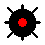

# Tactico

Tactico is a fog-of-war style turn based strategy game adapted from the popular board game 
Stratego. The goal of the game is to capture the flag (F).

    

The rank of enemy pieces is concealed 
until they enter into combat. Higher rank pieces will win when matched against lower rank pieces.
Mines (M) are unable to move or attack, but will destroy an opposing piece when attacked. The 
flail tank (3) can safely remove mines.
 

  

  

 
The sniper (1) can remove adjacent pieces if it can correctly identify their rank.

    

The Spy (S) can defeat the Terminator (10) if it initiates combat.
 

  

  

 

Pieces may move in one direction and attack in a turn. Piece movement is based on rank.

| Movement | 0    | 1                    | 2       | ∞ |
|----------|------|----------------------|---------|---|
| Pieces   | M, F | S, 1, 4, 5, 8, 9, 10 | 3, 6, 7 | 2 |

    

