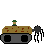
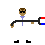

# Tactico

### Game Rules

Tactico is a fog-of-war style turn based strategy game adapted from the popular board game 
Stratego. The objective of the game is to capture the flag (F).

    

The rank of enemy pieces is concealed 
until they enter into combat. Higher rank pieces will win when matched against lower rank pieces.
Mines (M) are unable to move or attack, but will destroy an opposing piece when attacked. The 
flail tank (3) can safely remove mines.
 

  

  

 
The sniper (1) can remove adjacent pieces if it can correctly identify their rank.

    

The Spy (S) can defeat the Terminator (10) if it initiates combat.
 

  

  

 

Pieces may move in one direction and attack in a turn. Piece movement is based on rank.

| Movement | 0    | 1                    | 2       | ∞ |
|----------|------|----------------------|---------|---|
| Rank     | M, F | S, 1, 4, 5, 8, 9, 10 | 3, 6, 7 | 2 |

### Gameplay

The game begins with a setup phase where both players place the pieces from the bank within the 
deployment zone as indicated by the yellow squares. Once all pieces have been placed, either 
player may choose to start the game by pressing the 'esc' key.

    

Once the game has started, pieces may move based on the rules for their rank. Legal moves are 
highlighted with thick yellow outline. Thin yellow outline indicates the move made on the 
previous turn.

    

Following movement, you may choose to attack with the moved piece, or you may choose to end your 
turn using the 'esc' key. Legal attacks are indicated with a white outline. 

    

When a '1' attacks, you may guess the rank of the opposing piece by selecting the corresponding 
tile in the opponent's piece bank. The number in the upper left corner of these tiles indicates 
how many are remaining on the board. 

    

 

### Multiplayer
To host a multiplayer game, select the "Multiplayer" option in the main menu, and select "Host 
Game" in the popup window. To connect to a game server, change the IP address and port number to 
that of the host. For connections across a local area network, use the IPv4 address.

    

 

### Button Functionality

| Button   | 'esc' Key                   | Single Player                                                 | Multiplayer                       | Reset                                               | Close Server              | Quit           | Main Menu                                     | ¤                                                  | Refresh                             |
|----------|-----------------------------|---------------------------------------------------------------|-----------------------------------|-----------------------------------------------------|---------------------------|----------------|-----------------------------------------------|----------------------------------------------------|-------------------------------------|
| Function | ends turn, ends setup phase | begins offline game  (can still be played with 2 players) | launches multiplayer popup window | clears all piece placement  (grey when cleared) | closes multiplayer server | exits the game | returns to main menu, closes client if active | switches between letter and image display on tiles | requests server to resend game data |